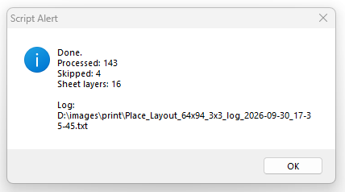

# Photoshop — Place Layout 64×94 (3×3)

Automatically places images from a folder onto an **A4 portrait** document, checks orientation, resizes each image to exactly **64 × 94 mm**, and arranges them **9 per sheet (3 × 3)**.

Each set of 9 images is merged into one Photoshop layer. A final incomplete set is merged as well.

## Versions

- `Place_Layout_64x94_3x3.jsx` — original layout script.
- `Place_Layout_64x94_3x3_safe_v2.jsx` — tested safe batch version. Files that fail to import or process are skipped, the batch continues, and the error is written to a TXT log.

The safe-version log is saved beside the JSX script when possible; if that location is not writable, it is saved in the selected source-image folder.

## Layout

- A4: **210 × 297 mm**
- Image: **64 × 94 mm**
- Grid: **3 × 3**
- Gaps: **2 mm**
- Margins: **7 mm left/right**, **5.5 mm top/bottom**

## How to run

1. Open an **A4 portrait document, 210 × 297 mm**, in Photoshop.
2. Choose **File → Scripts → Browse…**
3. Select `Place_Layout_64x94_3x3.jsx` or the recommended safe version `Place_Layout_64x94_3x3_safe_v2.jsx`.
4. Select the folder containing the source images.
5. The script checks orientation, places the images 3 × 3, and merges every 9 successful images into one layer.

Optional: copy the JSX file into Photoshop's `Presets/Scripts` folder and restart Photoshop. It will then appear directly under **File → Scripts**.

Supported formats: JPG, JPEG, PNG, TIFF, PSD, BMP.

## Tested safe-run result

The safe version was tested with a batch containing import failures:

- **143 processed**
- **4 skipped**
- **16 sheet layers**
- TXT error log created successfully

## Status

**Safe version tested successfully in Photoshop CS6.**

## Contact

For bugs, ideas, or workflows held together by too many clicks: [**usta.scripts@gmail.com**](mailto:usta.scripts@gmail.com)
