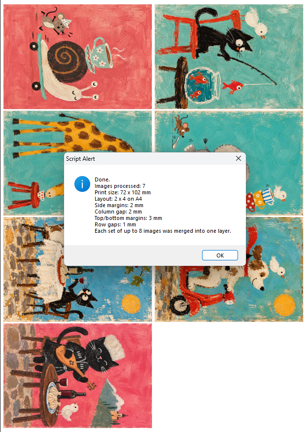

# Photoshop A7 Batch Print Layout — 8 Images on A4, 72×102 mm

A free **Photoshop JSX / ExtendScript** workflow for automatically preparing small-format images for print.

Select a folder and the layout script places different images at exactly **72 × 102 mm**, arranges **8 images on each A4 sheet**, and merges every completed sheet into a single Photoshop layer ready for printing.

The 72 × 102 mm print area is designed for **70 × 100 mm finished pieces with 1 mm bleed**.

This folder also includes a separate **signature / watermark placement script** for adding the same signature, logo, artist mark, or watermark to all 8 print positions without flattening or merging the watermark layers.

## Where this workflow is useful

- **mini photo prints and photo labs** — batch-preparing small prints from many different files
- **portrait, school, and event photography** — creating repeatable multi-photo print sheets
- **small art prints and mini portfolios** — fitting multiple finished artworks onto A4 efficiently
- **stickers, sublimation, transfers, magnets, and craft production** — preparing small-format artwork with bleed for trimming or transfer
- **artist signatures and branding** — placing the same signature, logo, watermark, or maker's mark on every print position
- **prepress and small-batch production** — automating repetitive exact-size placement in Photoshop

This is a production layout tool: it does not create a collage or edit the artwork. It automates the repetitive step between a folder of finished images and a print-ready A4 sheet.

## What the layout script does

- batch-imports supported images from a folder
- sorts files by filename
- corrects sideways orientation automatically
- places every image at exactly **72 × 102 mm**
- fits **8 different images per A4 sheet**
- merges each set of 8 into one sheet layer
- continues automatically with additional files

Supported formats: JPG, JPEG, PNG, TIFF, PSD, BMP.

## Signature / watermark helper

`Place_Signatures_72x102_2x4.jsx` is a separate Photoshop script for **batch-placing a signature, logo, watermark, artist mark, or branding element** over the finished 72 × 102 mm print layout.

It is useful when you need to:

- add the same **signature to multiple images in Photoshop**
- batch-place a **watermark or logo** on an A4 print sheet
- add an **artist signature** to every print without editing the source files
- place a **logo in the same corner of multiple images**
- keep every watermark or signature editable after automatic placement

### Signature placement

1. Open the completed 72 × 102 mm A4 layout.
2. Choose **File → Scripts → Browse…**
3. Run `Place_Signatures_72x102_2x4.jsx`.
4. Select the signature, logo, or watermark file.
5. The script places **8 independent Smart Objects**, one for each print position.

The source signature is scaled to **25 mm wide**, with height kept proportional.

The intended position is **3 mm from the right edge and 3 mm from the bottom edge of the original portrait artwork before layout rotation**. Because the 72 × 102 mm artwork is rotated 90° for the A4 sheet, the signature appears vertically near the **lower-left corner** of each placed image.

All 8 signature layers are stored inside:

`Signatures_72x102_2x4`

They are **not merged**. Each signature remains independently editable, movable, scalable, or replaceable.

The signature folder is a Photoshop **LayerSet**, not a normal ArtLayer. The repository's **Print All Layers** script therefore does not print that folder as a separate page; it remains visible as an overlay while the printable sheet layers are processed.

## Versions

- `Place_Layout_72x102.jsx` — original tested layout version
- `Place_Layout_72x102_safe_v2.jsx` — fault-tolerant batch layout version
- `Place_Signatures_72x102_2x4.jsx` — tested signature / watermark / logo placement helper

The safe layout version skips unreadable or failed files, logs the error, and continues without wasting a print position.

## How to run the layout

1. Open an **A4 portrait document (210 × 297 mm)** in Photoshop.
2. Choose **File → Scripts → Browse…**
3. Select `Place_Layout_72x102.jsx` or `Place_Layout_72x102_safe_v2.jsx`.
4. Select the folder containing your source images.
5. Photoshop builds the print sheets automatically.
6. If needed, run `Place_Signatures_72x102_2x4.jsx` afterward to add the signature or watermark overlay.

Optional: copy the JSX files into Photoshop's `Presets/Scripts` folder and restart Photoshop. They will then appear directly under **File → Scripts**.

## Tested result

The original layout script has been **tested successfully in Photoshop CS6**.

The signature / watermark helper has also been **tested successfully in the real 72 × 102 mm production layout**.

## Notes

- Images are initially placed as Smart Objects.
- Exact target dimensions are enforced; the script does not intelligently crop or recompose artwork.
- Standard ISO A7 is 74 × 105 mm. This production layout uses **72 × 102 mm** to provide a 1 mm bleed around a **70 × 100 mm finished piece**.
- Each completed sheet works directly with the repository's **Print All Layers** workflow.
- Signature / watermark layers stay editable and are not flattened into the print-sheet layers.

## Search terms

Photoshop watermark script, Photoshop signature script, batch watermark Photoshop, add logo to multiple images Photoshop, artist signature batch placement, Photoshop JSX watermark, Photoshop logo placement script, A7 print layout Photoshop, 72x102 print layout, multiple images on A4, batch print layout, Photoshop prepress automation.

## Status

**Original layout version tested successfully in Photoshop CS6. Signature / watermark helper tested successfully. Safe layout version added; production testing still required.**

## Contact

Have a Photoshop routine that feels suspiciously like unpaid data entry? [**usta.scripts@gmail.com**](mailto:usta.scripts@gmail.com)
